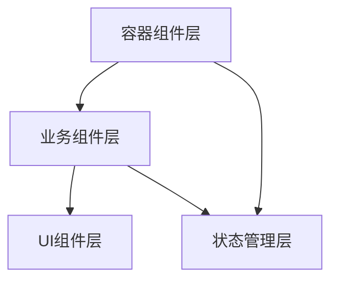
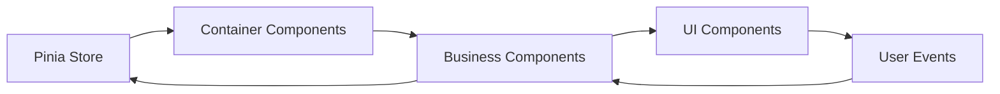
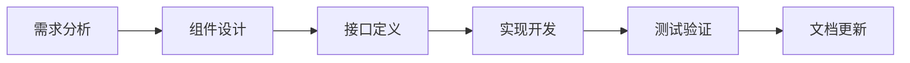

# Vue Cesium Ultimate 项目需求文档

## 📋 项目概述

**Vue Cesium Ultimate** 是一个基于 Vue 3 和 Cesium 的现代化 3D 地球可视化应用，专注于目标位置展示、关系连线可视化和抛物线轨迹分析。项目采用组件化架构设计，支持丰富的材质效果、动画控制和数据管理功能。

### 🎯 核心特性

- 🌍 **3D地球可视化**: 基于Cesium的高性能三维地球渲染
- 🔗 **智能关系连线**: 多种材质效果的动态关系可视化
- 🚀 **抛物线轨迹**: 参数化轨迹生成与动画播放
- 🎛️ **统一控制面板**: 集成化的参数控制与材质管理
- 📊 **数据管理**: 完整的数据导入、验证、转换和导出流程

### 🏗️ 技术架构

- **前端框架**: Vue 3 (Composition API)
- **3D引擎**: Cesium
- **状态管理**: Pinia
- **构建工具**: Vite
- **代码规范**: ESLint + Prettier

## 🚀 核心功能模块

### 🌍 1. 地图可视化模块

**状态**: ✅ 已完成核心功能

#### 1.1 基础地图功能

- [x] **Cesium引擎**: 三维地球初始化与渲染
- [x] **交互控制**: 缩放、旋转、平移等流畅操作
- [x] **视角管理**: 相机位置和角度的精确控制
- [x] **地形影像**: 高精度地形和卫星影像加载

#### 1.2 目标点位管理

- [x] **数据结构**: 标准化目标点位数据模型
- [x] **多类型渲染**: 支持飞机、雷达、基站等图标类型
- [x] **交互响应**: 点击选择、悬停预览等用户交互
- [x] **信息展示**: 动态信息面板和详情展示
- [ ] **组件化需求**: 封装 `TargetMarker` 组件
- [ ] **组件化需求**: 封装 `TargetInfoPanel` 组件

### 🔗 2. 关系连线模块

**状态**: ✅ 已完成核心功能

#### 2.1 基础连线功能

- [x] **静态连线**: 普通直线关系可视化
- [x] **动态飞线**: 流动效果的关系连线
- [x] **脉冲效果**: 周期性脉冲动画连线
- [x] **抛物线轨迹**: 三维空间抛物线路径
- [ ] **组件化需求**: 封装 `RelationLine` 组件

#### 2.2 材质系统

- [x] **传统材质**: Material 材质管理系统
- [x] **属性材质**: MaterialProperty 动态材质系统
- [x] **动态切换**: 实时材质模式切换
- [x] **自定义注册**: 支持自定义材质类型注册
- [x] **组件集成**: MaterialControl 已合并到 ControlPanel ✅
- [x] **状态管理**: Pinia store 统一状态管理 ✅
- [x] **代码重构**: 着色器代码统一管理（shaders.js）✅
- [x] **错误修复**: 模块间引用错误修复 ✅
- [x] **配置管理**: 可视化配置独立文件管理（visualConfig.js）✅
- [x] **代码优化**: switch语句重构，提升可读性 ✅
- [ ] **组件化需求**: 封装 `MaterialPropertyEditor` 组件

### 🚀 3. 抛物线工具模块

**状态**: ✅ 已完成核心功能

#### 3.1 抛物线生成

- [x] **轨迹算法**: 基于物理的抛物线轨迹计算
- [x] **智能高度**: 自动高度计算和优化
- [x] **批量处理**: 支持多条抛物线批量生成
- [x] **参数配置**: 灵活的轨迹参数调整
- [ ] **组件化需求**: 封装 `ParabolaGenerator` 组件
- [ ] **组件化需求**: 封装 `ParabolaConfigPanel` 组件

#### 3.2 抛物线材质

- [x] **飞线材质**: 流动效果的抛物线材质
- [x] **脉冲材质**: 脉冲动画的抛物线材质
- [x] **动态调整**: 实时材质参数调整
- [ ] **组件化需求**: 封装 `ParabolaMaterialEditor` 组件

### 🎛️ 4. 控制面板模块

**状态**: ✅ 已完成基础功能

#### 4.1 基础控制

- [x] **材质切换**: 材质模式的快速切换
- [x] **目标筛选**: 按类型筛选目标显示
- [x] **关系筛选**: 按类型筛选关系连线
- [x] **统一面板**: ControlPanel 组件已优化 ✅
- [x] **拖拽折叠**: 通用拖拽折叠Hook实现 ✅
- [ ] **组件化需求**: 封装 `FilterPanel` 组件

#### 4.1.1 拖拽折叠功能

- [x] **通用Hook**: `useDraggableCollapse` 公共Hook ✅
- [x] **拖拽移动**: 支持面板拖拽移动 ✅
- [x] **折叠切换**: 支持面板折叠/展开 ✅
- [x] **触摸支持**: 移动端触摸拖拽支持 ✅
- [x] **位置约束**: 拖拽边界限制 ✅
- [x] **样式管理**: 拖拽状态样式反馈 ✅
- [x] **智能防误触**: 拖拽完成后防止意外折叠 ✅
- [x] **TargetPanel集成**: 目标面板应用拖拽折叠 ✅
- [x] **ControlPanel集成**: 控制面板应用拖拽折叠 ✅

#### 4.2 高级控制

- [ ] **时间轴**: 时间维度的数据控制
- [ ] **动画播放**: 场景动画的播放控制
- [ ] **场景管理**: 场景配置的保存和加载
- [ ] **组件化需求**: 封装 `TimelineControl` 组件
- [ ] **组件化需求**: 封装 `AnimationControl` 组件
- [ ] **组件化需求**: 封装 `SceneManager` 组件

### 📊 5. 数据管理模块

**状态**: 🔄 开发中

#### 5.1 数据结构

- [x] **目标数据**: 标准化目标数据结构
- [x] **关系数据**: 关系连线数据结构
- [x] **配置数据**: 系统配置数据结构
- [ ] **组件化需求**: 封装 `DataProvider` 组件
- [ ] **组件化需求**: 封装 `DataValidator` 组件

#### 5.2 数据操作

- [x] **数据加载**: 从多种数据源加载数据
- [x] **数据筛选**: 基于条件的数据筛选
- [x] **数据更新**: 实时数据更新机制
- [ ] **数据导入导出**: 支持多格式数据导入导出
- [ ] **组件化需求**: 封装 `DataImporter` 组件
- [ ] **组件化需求**: 封装 `DataExporter` 组件

## 🏗️ 组件化架构设计

### 🎯 设计理念

项目采用现代化的组件化架构，遵循以下核心设计原则：

| 原则           | 描述                             | 实现方式         |
| -------------- | -------------------------------- | ---------------- |
| **关注点分离** | UI展示、业务逻辑和数据管理分离   | 分层架构设计     |
| **可复用性**   | 组件设计考虑复用性，避免重复开发 | 通用组件抽象     |
| **可维护性**   | 清晰的组件层次和职责划分         | 标准化命名和文档 |
| **可扩展性**   | 易于添加新功能和组件             | 插件化设计模式   |
| **性能优化**   | 合理的组件拆分和懒加载策略       | 按需加载和缓存   |

### 📊 组件分层架构



#### 🎨 UI组件层（Presentation Layer）

- **职责**: 纯展示组件，只负责渲染
- **特点**: 无状态、可复用、通过props接收数据
- **示例**: `TargetMarker`、`RelationLine`、`MaterialSelector`

#### 💼 业务组件层（Business Layer）

- **职责**: 包含业务逻辑的组件，负责数据处理
- **特点**: 有状态、业务相关、处理用户交互
- **示例**: `ControlPanel`、`ParabolaTools`、`DataManager`

#### 📦 容器组件层（Container Layer）

- **职责**: 组合多个组件，协调组件间通信
- **特点**: 布局管理、状态协调、生命周期管理
- **示例**: `App`、`DataVisualization`、`TargetPanel`

### 🔄 数据流设计



#### 数据流向原则

- **向下传递**: 数据通过props从父组件向子组件传递
- **向上传递**: 事件通过emit从子组件向父组件传递
- **全局状态**: 通过Pinia进行全局状态管理

### 🌳 核心组件层次结构

```
🏠 App (主容器 - Container)
├── 🎛️ ControlPanel (控制面板 - Business) ✅ 已完成
│   ├── 🔍 FilterPanel (筛选面板 - UI) 🔄 待开发
│   ├── ⏱️ TimelineControl (时间轴控制 - UI) 🔄 待开发
│   ├── ▶️ AnimationControl (动画控制 - UI) 🔄 待开发
│   ├── 🎨 MaterialModeToggle (材质模式切换) ✅ 已集成
│   ├── 🎯 MaterialTypeSelector (材质类型选择) ✅ 已集成
│   ├── ⚡ SpeedControl (速度控制) ✅ 已集成
│   ├── 🌫️ OpacityControl (透明度控制) ✅ 已集成
│   └── 🎨 ColorPresets (颜色预设) ✅ 已集成
├── 📋 TargetPanel (目标面板 - Business) 🔄 待开发
│   ├── 📝 TargetList (目标列表 - UI)
│   └── ℹ️ TargetInfoPanel (信息面板 - UI)
├── 🌍 DataVisualization (数据可视化 - UI) ✅ 已完成
│   ├── 🗺️ CesiumViewer (地图容器)
│   ├── 📍 TargetLayer (目标图层)
│   │   └── 🎯 TargetMarker (目标标记) 🔄 待组件化
│   └── 🔗 RelationLayer (关系图层)
│       └── ➡️ RelationLine (关系连线) 🔄 待组件化
├── 🚀 ParabolaTools (抛物线工具 - Business) 🔄 待开发
│   ├── ⚙️ ParabolaGenerator (抛物线生成器)
│   ├── 🎛️ ParabolaConfigPanel (配置面板)
│   └── 🎨 ParabolaMaterialEditor (材质编辑器)
└── 📊 DataManager (数据管理 - Business) 🔄 待开发
    ├── 📡 DataProvider (数据提供者)
    ├── ✅ DataValidator (数据验证器)
    ├── 📥 DataImporter (数据导入器)
    └── 📤 DataExporter (数据导出器)
```

#### 📊 组件状态说明

- ✅ **已完成**: 功能完整，代码稳定
- 🔄 **待开发**: 计划开发或正在开发中
- 🔄 **待组件化**: 功能已实现，需要组件化重构

### 🎯 组件设计原则

| 原则         | 描述                         | 实现标准                   |
| ------------ | ---------------------------- | -------------------------- |
| **单一职责** | 每个组件只负责一个特定功能   | 组件功能边界清晰，职责单一 |
| **可复用性** | 组件应该可以在不同场景下复用 | 通过props配置，避免硬编码  |
| **可配置性** | 通过props提供灵活的配置选项  | 完整的props定义和默认值    |
| **事件驱动** | 使用事件进行组件间通信       | 标准化的事件命名和参数     |
| **状态管理** | 使用Pinia进行全局状态管理    | 合理的状态分层和模块化     |
| **分层清晰** | UI组件与业务组件分离         | 严格的分层架构和依赖关系   |

## 📚 开发规范

### 📁 项目文件结构

```
src/
├── 📁 components/           # 组件目录
│   ├── 📁 ui/              # 🎨 纯UI组件
│   │   ├── DataVisualization.vue
│   │   ├── TargetMarker.vue
│   │   ├── RelationLine.vue
│   │   └── 📁 common/      # 通用UI组件
│   ├── 📁 business/        # 💼 业务组件
│   │   ├── ControlPanel.vue
│   │   ├── TargetPanel.vue
│   │   ├── ParabolaTools.vue
│   │   └── 📁 tools/       # 工具组件
│   └── 📁 containers/      # 📦 容器组件
│       └── App.vue
├── 📁 composables/         # 🔧 组合式函数
├── 📁 utils/               # 🛠️ 工具函数
│   ├── materials.js        # 材质管理
│   ├── shaders.js          # 着色器管理
│   └── parabola.js         # 抛物线计算
├── 📁 stores/              # 🗄️ 状态管理
├── 📁 config/              # ⚙️ 配置文件
│   └── visualConfig.js     # 可视化配置
├── 📁 types/               # 📝 TypeScript类型
└── 📁 examples/            # 📖 示例代码
```

### 📝 命名规范

| 类型         | 规范            | 示例               |
| ------------ | --------------- | ------------------ |
| **组件文件** | PascalCase      | `ControlPanel.vue` |
| **组件内部** | Composition API | `<script setup>`   |
| **Props**    | camelCase       | `materialType`     |
| **Events**   | kebab-case      | `material-changed` |
| **Store**    | camelCase       | `useMaterialStore` |
| **工具函数** | camelCase       | `createParabola`   |

### ✅ 代码质量标准

- ✅ **TypeScript**: 所有组件必须有完整的类型定义
- ✅ **JSDoc**: 所有公共方法必须有详细注释
- ✅ **单元测试**: 关键组件必须有测试覆盖
- ✅ **Vue 3**: 遵循Vue 3 Composition API最佳实践
- ✅ **ESLint**: 代码必须通过ESLint检查
- ✅ **Prettier**: 统一的代码格式化

## 🔧 组件开发规范

### 🎨 UI组件规范

| 规范项       | 要求                         | 检查标准              |
| ------------ | ---------------------------- | --------------------- |
| **纯净性**   | 不包含业务逻辑，只负责展示   | 无状态管理，无API调用 |
| **数据接收** | 通过props接收所有需要的数据  | 完整的props定义和验证 |
| **事件传递** | 通过emit向父组件传递事件     | 标准化的事件命名      |
| **样式隔离** | 使用scoped样式，避免全局污染 | 所有样式使用scoped    |
| **可复用性** | 设计时考虑复用性，避免硬编码 | 通过props配置所有变量 |

### 💼 业务组件规范

| 规范项       | 要求                             | 检查标准      |
| ------------ | -------------------------------- | ------------- |
| **职责单一** | 每个组件只负责一个特定的业务功能 | 功能边界清晰  |
| **状态管理** | 使用Pinia进行全局状态管理        | 合理使用store |
| **数据处理** | 在组件内部处理业务逻辑           | 逻辑封装完整  |
| **错误处理** | 包含完整的错误处理机制           | try-catch覆盖 |

### 📦 容器组件规范

| 规范项           | 要求                   | 检查标准       |
| ---------------- | ---------------------- | -------------- |
| **组件组合**     | 负责组合多个子组件     | 清晰的组件层次 |
| **数据流控制**   | 控制数据在组件间的流动 | 数据流向明确   |
| **事件协调**     | 协调子组件间的事件通信 | 事件处理完整   |
| **生命周期管理** | 管理子组件的生命周期   | 资源管理合理   |

## 🗺️ 开发路线图

### 🎯 Phase 1: 架构重构（已完成）

- ✅ `DataVisualization` 重构为纯UI组件
- ✅ 控制面板集成到 `App.vue`
- ✅ 文件夹结构优化，区分UI和业务组件
- ✅ 数据流优化，通过props传递数据

### 🔧 Phase 2: 基础组件封装（进行中）

- 🔄 封装 `TargetMarker` 组件
- 🔄 封装 `RelationLine` 组件
- 🔄 封装 `MaterialSelector` 组件
- ✅ 优化现有 `ControlPanel` 组件

### ⚡ Phase 3: 高级功能组件（计划中）

- 📋 封装 `ParabolaGenerator` 组件
- 📋 封装 `MaterialPropertyEditor` 组件
- 📋 封装 `TimelineControl` 组件
- 📋 封装 `AnimationControl` 组件

### 📊 Phase 4: 数据管理组件（计划中）

- 📋 封装 `DataProvider` 组件
- 📋 封装 `DataImporter/Exporter` 组件
- 📋 封装 `DataValidator` 组件
- 📋 完善数据流管理

### 🚀 Phase 5: 性能优化与测试（计划中）

- 📋 组件性能优化
- 📋 单元测试覆盖
- 📋 集成测试
- 📋 文档完善

#### 📊 进度说明

- ✅ **已完成**: 功能开发完成并测试通过
- 🔄 **进行中**: 正在开发或测试中
- 📋 **计划中**: 已规划，等待开发

## 📖 扩展指南

### 🔄 功能开发流程



| 步骤         | 说明                       | 输出物   |
| ------------ | -------------------------- | -------- |
| **需求分析** | 在本文档中添加新的功能需求 | 需求描述 |
| **组件设计** | 确定组件架构和职责划分     | 设计方案 |
| **接口定义** | 定义Props、Events和Slots   | 接口文档 |
| **实现开发** | 按照开发规范实现组件       | 代码实现 |
| **测试验证** | 编写单元测试和集成测试     | 测试用例 |
| **文档更新** | 更新需求文档和组件文档     | 文档更新 |

## 📚 版本历史

| 版本       | 发布日期 | 主要更新                         | 状态      |
| ---------- | -------- | -------------------------------- | --------- |
| **v1.0.0** | 2024-10  | 初始版本，基础地图可视化功能     | ✅ 已发布 |
| **v1.1.0** | 2024-11  | 抛物线工具和MaterialProperty系统 | ✅ 已发布 |
| **v1.2.0** | 2024-11  | 组件化重构第一阶段               | ✅ 已发布 |
| **v1.2.1** | 2024-11  | 材质控制系统重构                 | ✅ 已发布 |
| **v1.2.2** | 2024-12  | 组件合并与优化                   | ✅ 已发布 |
| **v1.2.3** | 2024-12  | 代码重构与错误修复               | ✅ 已发布 |
| **v1.2.4** | 2024-12  | 配置管理优化                     | ✅ 已发布 |
| **v1.2.5** | 2024-12  | 代码结构优化                     | ✅ 已发布 |
| **v1.2.6** | 2024-12  | 代码清理优化                     | ✅ 已发布 |
| **v1.2.7** | 2024-12  | 着色器系统修复与材质初始化优化   | ✅ 已发布 |
| **v1.3.0** | 2025-01  | 组件化重构第二阶段               | 🔄 计划中 |

---

## 📄 文档信息

| 项目            | 信息                |
| --------------- | ------------------- |
| **📅 最后更新** | 2024年12月          |
| **👨‍💻 维护者**   | AI Assistant        |
| **📊 项目状态** | 🚀 活跃开发中       |
| **📝 文档版本** | v2.0.0              |
| **🔗 仓库地址** | Vue Cesium Ultimate |

> 💡 **提示**: 本文档采用现代化的Markdown格式，支持表格、图表和emoji，便于阅读和维护。
