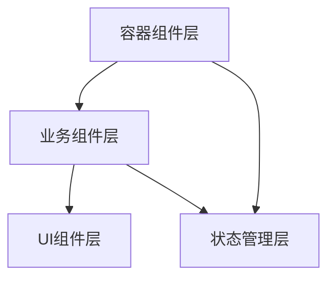
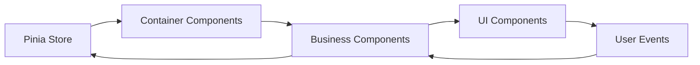
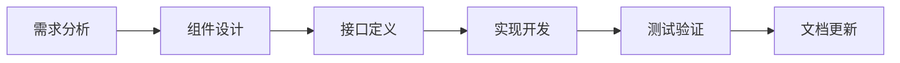

# Vue Cesium Ultimate 项目需求文档

## 📋 项目概述

**Vue Cesium Ultimate** 是一个基于 Vue 3 和 Cesium 的现代化 3D 地球可视化应用，专注于目标位置展示、关系连线可视化和抛物线轨迹分析。项目采用组件化架构设计，支持丰富的材质效果、动画控制和数据管理功能。

### 🎯 核心特性

- 🌍 **3D地球可视化**: 基于Cesium的高性能三维地球渲染
- 🔗 **智能关系连线**: 多种材质效果的动态关系可视化
- 🚀 **抛物线轨迹**: 参数化轨迹生成与动画播放
- 🎛️ **统一控制面板**: 集成化的参数控制与材质管理
- 📊 **数据管理**: 完整的数据导入、验证、转换和导出流程

### 🏗️ 技术架构

- **前端框架**: Vue 3 (Composition API)
- **3D引擎**: Cesium
- **状态管理**: Pinia
- **构建工具**: Vite
- **代码规范**: ESLint + Prettier

## 🚀 核心功能模块

### 🌍 1. 地图可视化模块

**状态**: ✅ 已完成核心功能

#### 1.1 基础地图功能

- [x] **Cesium引擎**: 三维地球初始化与渲染
- [x] **交互控制**: 缩放、旋转、平移等流畅操作
- [x] **视角管理**: 相机位置和角度的精确控制
- [x] **地形影像**: 高精度地形和卫星影像加载

#### 1.2 目标点位管理

- [x] **数据结构**: 标准化目标点位数据模型
- [x] **多类型渲染**: 支持飞机、雷达、基站等图标类型
- [x] **交互响应**: 点击选择、悬停预览等用户交互
- [x] **信息展示**: 动态信息面板和详情展示
- [ ] **组件化需求**: 封装 `TargetMarker` 组件
- [ ] **组件化需求**: 封装 `TargetInfoPanel` 组件

### 🔗 2. 关系连线模块

**状态**: ✅ 已完成核心功能

#### 2.1 基础连线功能

- [x] **静态连线**: 普通直线关系可视化
- [x] **动态飞线**: 流动效果的关系连线
- [x] **脉冲效果**: 周期性脉冲动画连线
- [x] **抛物线轨迹**: 三维空间抛物线路径
- [ ] **组件化需求**: 封装 `RelationLine` 组件

#### 2.2 材质系统

- [x] **传统材质**: Material 材质管理系统
- [x] **属性材质**: MaterialProperty 动态材质系统
- [x] **动态切换**: 实时材质模式切换
- [x] **自定义注册**: 支持自定义材质类型注册
- [x] **基础材质**: 支持基本的线条材质 ✅
- [x] **动态纹理**: 动态纹理材质效果 ✅
- [x] **抛物线飞线**: 抛物线飞线材质效果 ✅
- [x] **脉冲线**: 脉冲线材质效果 ✅
- [x] **材质属性类**: 统一的材质属性管理 ✅
- [x] **着色器系统**: GLSL着色器代码优化 ✅
- [x] **GLSL语法修复**: 着色器语法错误修复和优化 ✅
- [x] **着色器性能**: 着色器性能和兼容性提升 ✅
- [x] **材质初始化**: 防重复注册机制 ✅
- [x] **组件集成**: MaterialControl 已合并到 ControlPanel ✅
- [x] **状态管理**: Pinia store 统一状态管理 ✅
- [x] **代码重构**: 着色器代码统一管理（shaders.js）✅
- [x] **错误修复**: 模块间引用错误修复 ✅
- [x] **配置管理**: 可视化配置独立文件管理（visualConfig.js）✅
- [x] **代码优化**: switch语句重构，提升可读性 ✅
- [ ] **自定义材质**: 用户自定义材质编辑器
- [ ] **材质预设**: 预设材质库管理
- [ ] **组件化需求**: 封装 `MaterialPropertyEditor` 组件
- [ ] **组件化需求**: 封装 `MaterialEditor` 组件
- [ ] **组件化需求**: 封装 `MaterialPresets` 组件

### 🚀 3. 抛物线工具模块

**状态**: ✅ 已完成核心功能

#### 3.1 抛物线生成

- [x] **轨迹算法**: 基于物理的抛物线轨迹计算
- [x] **智能高度**: 自动高度计算和优化
- [x] **批量处理**: 支持多条抛物线批量生成
- [x] **参数配置**: 灵活的轨迹参数调整
- [ ] **组件化需求**: 封装 `ParabolaGenerator` 组件
- [ ] **组件化需求**: 封装 `ParabolaConfigPanel` 组件

#### 3.2 抛物线材质

- [x] **飞线材质**: 流动效果的抛物线材质
- [x] **脉冲材质**: 脉冲动画的抛物线材质
- [x] **动态调整**: 实时材质参数调整
- [ ] **组件化需求**: 封装 `ParabolaMaterialEditor` 组件

### 🎛️ 4. 控制面板模块

**状态**: ✅ 已完成基础功能

#### 4.1 基础控制

- [x] **材质切换**: 材质模式的快速切换
- [x] **目标筛选**: 按类型筛选目标显示
- [x] **关系筛选**: 按类型筛选关系连线
- [x] **统一面板**: ControlPanel 组件已优化 ✅
- [x] **拖拽折叠**: 通用拖拽折叠Hook实现 ✅
- [x] **错误处理**: 控制面板错误处理机制 ✅
- [x] **状态同步**: 控制面板与材质系统状态同步 ✅
- [ ] **组件化需求**: 封装 `FilterPanel` 组件

#### 4.1.1 拖拽折叠功能

- [x] **通用Hook**: `useDraggableCollapse` 公共Hook ✅
- [x] **拖拽移动**: 支持面板拖拽移动 ✅
- [x] **折叠切换**: 支持面板折叠/展开 ✅
- [x] **触摸支持**: 移动端触摸拖拽支持 ✅
- [x] **位置约束**: 拖拽边界限制 ✅
- [x] **样式管理**: 拖拽状态样式反馈 ✅
- [x] **智能防误触**: 拖拽完成后防止意外折叠 ✅
- [x] **TargetPanel集成**: 目标面板应用拖拽折叠 ✅
- [x] **ControlPanel集成**: 控制面板应用拖拽折叠 ✅

#### 4.2 高级控制

- [ ] **时间轴**: 时间维度的数据控制
- [ ] **动画播放**: 场景动画的播放控制
- [ ] **场景管理**: 场景配置的保存和加载
- [ ] **组件化需求**: 封装 `TimelineControl` 组件
- [ ] **组件化需求**: 封装 `AnimationControl` 组件
- [ ] **组件化需求**: 封装 `SceneManager` 组件

### 📊 5. 数据管理模块

**状态**: ✅ 基础功能完成

#### 5.1 数据结构

- [x] **目标数据**: 标准化目标数据结构 ✅
- [x] **关系数据**: 关系连线数据结构 ✅
- [x] **事件数据**: 事件管理数据结构 ✅
- [x] **配置数据**: 系统配置数据结构 ✅
- [x] **材质数据**: 材质属性数据结构统一 ✅
- [x] **状态数据**: 应用状态数据管理 ✅
- [x] **数据加载时序**: 数据加载顺序控制机制 ✅
- [ ] **组件化需求**: 封装 `DataProvider` 组件
- [ ] **组件化需求**: 封装 `DataValidator` 组件

#### 5.2 数据操作

- [x] **数据加载**: 从多种数据源加载数据 ✅
- [x] **数据筛选**: 基于条件的数据筛选 ✅
- [x] **数据更新**: 实时数据更新机制 ✅
- [x] **状态管理**: Pinia状态管理集成 ✅
- [x] **数据验证**: 基础数据验证机制 ✅
- [x] **数据同步**: 多数据源同步加载机制 ✅
- [x] **事件管理**: EventManager 事件数据管理器 ✅
- [ ] **数据导入导出**: 支持多格式数据导入导出
- [ ] **组件化需求**: 封装 `DataImporter` 组件
- [ ] **组件化需求**: 封装 `DataExporter` 组件

## 🏗️ 组件化架构设计

### 🎯 设计理念

项目采用现代化的组件化架构，遵循以下核心设计原则：

| 原则           | 描述                             | 实现方式         |
| -------------- | -------------------------------- | ---------------- |
| **关注点分离** | UI展示、业务逻辑和数据管理分离   | 分层架构设计     |
| **可复用性**   | 组件设计考虑复用性，避免重复开发 | 通用组件抽象     |
| **可维护性**   | 清晰的组件层次和职责划分         | 标准化命名和文档 |
| **可扩展性**   | 易于添加新功能和组件             | 插件化设计模式   |
| **性能优化**   | 合理的组件拆分和懒加载策略       | 按需加载和缓存   |

### 📊 组件分层架构



#### 🎨 UI组件层（Presentation Layer）

- **职责**: 纯展示组件，只负责渲染
- **特点**: 无状态、可复用、通过props接收数据
- **示例**: `TargetMarker`、`RelationLine`、`MaterialSelector`

#### 💼 业务组件层（Business Layer）

- **职责**: 包含业务逻辑的组件，负责数据处理
- **特点**: 有状态、业务相关、处理用户交互
- **示例**: `ControlPanel`、`ParabolaTools`、`DataManager`

#### 📦 容器组件层（Container Layer）

- **职责**: 组合多个组件，协调组件间通信
- **特点**: 布局管理、状态协调、生命周期管理
- **示例**: `App`、`DataVisualization`、`TargetPanel`

### 🔄 数据流设计



#### 数据流向原则

- **向下传递**: 数据通过props从父组件向子组件传递
- **向上传递**: 事件通过emit从子组件向父组件传递
- **全局状态**: 通过Pinia进行全局状态管理

### 🌳 核心组件层次结构

```
🏠 App (主容器 - Container) ✅ 已完成
├── 🎛️ ControlPanel (控制面板 - Business) ✅ 已完成
│   ├── 🔍 FilterPanel (筛选面板 - UI) 🔄 待开发
│   ├── ⏱️ TimelineControl (时间轴控制 - UI) 🔄 待开发
│   ├── ▶️ AnimationControl (动画控制 - UI) 🔄 待开发
│   ├── 🎨 MaterialModeToggle (材质模式切换) ✅ 已集成
│   ├── 🎯 MaterialTypeSelector (材质类型选择) ✅ 已集成
│   ├── ⚡ SpeedControl (速度控制) ✅ 已集成
│   ├── 🌫️ OpacityControl (透明度控制) ✅ 已集成
│   ├── 🎨 ColorPresets (颜色预设) ✅ 已集成
│   └── 🛡️ ErrorHandling (错误处理) ✅ 已集成
├── 📋 TargetPanel (目标面板 - Business) 🔄 待开发
│   ├── 📝 TargetList (目标列表 - UI)
│   └── ℹ️ TargetInfoPanel (信息面板 - UI)
├── 🌍 DataVisualization (数据可视化 - UI) ✅ 已完成
│   ├── 🗺️ CesiumViewer (地图容器) ✅ 已完成
│   ├── 📍 TargetLayer (目标图层) ✅ 已完成
│   │   └── 🎯 TargetMarker (目标标记) 🔄 待组件化
│   ├── 🔗 RelationLayer (关系图层) ✅ 已完成
│   │   └── ➡️ RelationLine (关系连线) 🔄 待组件化
│   └── 🎨 MaterialSystem (材质系统) ✅ 已完成
│       ├── 🏗️ MaterialProperty (材质属性类) ✅ 已完成
│       ├── 🎯 ShaderManager (着色器管理) ✅ 已完成
│       └── 🔧 MaterialInitializer (材质初始化) ✅ 已完成
├── 🚀 ParabolaTools (抛物线工具 - Business) 🔄 待开发
│   ├── ⚙️ ParabolaGenerator (抛物线生成器)
│   ├── 🎛️ ParabolaConfigPanel (配置面板)
│   └── 🎨 ParabolaMaterialEditor (材质编辑器)
└── 📊 DataManager (数据管理 - Business) 🔄 待开发
    ├── 📡 DataProvider (数据提供者)
    ├── ✅ DataValidator (数据验证器)
    ├── 📥 DataImporter (数据导入器)
    └── 📤 DataExporter (数据导出器)
```

#### 📊 组件状态说明

- ✅ **已完成**: 功能完整，代码稳定
- 🔄 **待开发**: 计划开发或正在开发中
- 🔄 **待组件化**: 功能已实现，需要组件化重构

### 🎯 组件设计原则

| 原则         | 描述                         | 实现标准                   |
| ------------ | ---------------------------- | -------------------------- |
| **单一职责** | 每个组件只负责一个特定功能   | 组件功能边界清晰，职责单一 |
| **可复用性** | 组件应该可以在不同场景下复用 | 通过props配置，避免硬编码  |
| **可配置性** | 通过props提供灵活的配置选项  | 完整的props定义和默认值    |
| **事件驱动** | 使用事件进行组件间通信       | 标准化的事件命名和参数     |
| **状态管理** | 使用Pinia进行全局状态管理    | 合理的状态分层和模块化     |
| **分层清晰** | UI组件与业务组件分离         | 严格的分层架构和依赖关系   |

## 📚 开发规范

### 📁 项目文件结构

```
src/
├── 📁 components/           # 组件目录
│   ├── 📁 ui/              # 🎨 纯UI组件
│   │   ├── DataVisualization.vue
│   │   ├── TargetMarker.vue
│   │   ├── RelationLine.vue
│   │   └── 📁 common/      # 通用UI组件
│   ├── 📁 business/        # 💼 业务组件
│   │   ├── ControlPanel.vue
│   │   ├── TargetPanel.vue
│   │   ├── ParabolaTools.vue
│   │   └── 📁 tools/       # 工具组件
│   └── 📁 containers/      # 📦 容器组件
│       └── App.vue
├── 📁 composables/         # 🔧 组合式函数
├── 📁 utils/               # 🛠️ 工具函数
│   ├── materials.js        # 材质管理
│   ├── shaders.js          # 着色器管理
│   └── parabola.js         # 抛物线计算
├── 📁 stores/              # 🗄️ 状态管理
├── 📁 config/              # ⚙️ 配置文件
│   └── visualConfig.js     # 可视化配置
├── 📁 types/               # 📝 TypeScript类型
└── 📁 examples/            # 📖 示例代码
```

### 📝 命名规范

| 类型         | 规范            | 示例               |
| ------------ | --------------- | ------------------ |
| **组件文件** | PascalCase      | `ControlPanel.vue` |
| **组件内部** | Composition API | `<script setup>`   |
| **Props**    | camelCase       | `materialType`     |
| **Events**   | kebab-case      | `material-changed` |
| **Store**    | camelCase       | `useMaterialStore` |
| **工具函数** | camelCase       | `createParabola`   |

### ✅ 代码质量标准

- ✅ **TypeScript**: 所有组件必须有完整的类型定义
- ✅ **JSDoc**: 所有公共方法必须有详细注释
- ✅ **单元测试**: 关键组件必须有测试覆盖
- ✅ **Vue 3**: 遵循Vue 3 Composition API最佳实践
- ✅ **ESLint**: 代码必须通过ESLint检查
- ✅ **Prettier**: 统一的代码格式化

## 🔧 组件开发规范

### 🎨 UI组件规范

| 规范项       | 要求                         | 检查标准              |
| ------------ | ---------------------------- | --------------------- |
| **纯净性**   | 不包含业务逻辑，只负责展示   | 无状态管理，无API调用 |
| **数据接收** | 通过props接收所有需要的数据  | 完整的props定义和验证 |
| **事件传递** | 通过emit向父组件传递事件     | 标准化的事件命名      |
| **样式隔离** | 使用scoped样式，避免全局污染 | 所有样式使用scoped    |
| **可复用性** | 设计时考虑复用性，避免硬编码 | 通过props配置所有变量 |

### 💼 业务组件规范

| 规范项       | 要求                             | 检查标准      |
| ------------ | -------------------------------- | ------------- |
| **职责单一** | 每个组件只负责一个特定的业务功能 | 功能边界清晰  |
| **状态管理** | 使用Pinia进行全局状态管理        | 合理使用store |
| **数据处理** | 在组件内部处理业务逻辑           | 逻辑封装完整  |
| **错误处理** | 包含完整的错误处理机制           | try-catch覆盖 |

### 📦 容器组件规范

| 规范项           | 要求                   | 检查标准       |
| ---------------- | ---------------------- | -------------- |
| **组件组合**     | 负责组合多个子组件     | 清晰的组件层次 |
| **数据流控制**   | 控制数据在组件间的流动 | 数据流向明确   |
| **事件协调**     | 协调子组件间的事件通信 | 事件处理完整   |
| **生命周期管理** | 管理子组件的生命周期   | 资源管理合理   |

## 🗺️ 开发路线图

### 🎯 Phase 1: 架构重构（已完成）

- ✅ `DataVisualization` 重构为纯UI组件
- ✅ 控制面板集成到 `App.vue`
- ✅ 文件夹结构优化，区分UI和业务组件
- ✅ 数据流优化，通过props传递数据
- ✅ 材质系统架构重构和优化
- ✅ 着色器系统GLSL语法修复

### 🔧 Phase 2: 基础组件封装（进行中）

- 🔄 封装 `TargetMarker` 组件
- 🔄 封装 `RelationLine` 组件
- ✅ 材质属性类统一管理
- ✅ 材质初始化系统优化
- ✅ 优化现有 `ControlPanel` 组件
- ✅ 错误处理机制完善

### ⚡ Phase 3: 高级功能组件（计划中）

- 📋 封装 `ParabolaGenerator` 组件
- 📋 封装 `MaterialPropertyEditor` 组件
- 📋 封装 `TimelineControl` 组件
- 📋 封装 `AnimationControl` 组件

### 📊 Phase 4: 数据管理组件（计划中）

- 📋 封装 `DataProvider` 组件
- 📋 封装 `DataImporter/Exporter` 组件
- 📋 封装 `DataValidator` 组件
- 📋 完善数据流管理

### 🚀 Phase 5: 性能优化与测试（计划中）

- 📋 组件性能优化
- 📋 单元测试覆盖
- 📋 集成测试
- 📋 文档完善

#### 📊 进度说明

- ✅ **已完成**: 功能开发完成并测试通过
- 🔄 **进行中**: 正在开发或测试中
- 📋 **计划中**: 已规划，等待开发

## 📖 版本历史

### v1.3.2 (2024-12-19)

**事件数据管理功能**

#### 📊 数据结构扩展

- **事件数据文件**: 新增 `eventData.json` 事件数据文件
- **事件数据模型**: 定义完整的事件数据结构
  - `id`: 事件唯一标识符
  - `sourceId`: 事件源头目标ID
  - `targetId`: 事件目标ID
  - `description`: 事件描述信息
  - `startTime`: 事件开始时间
  - `endTime`: 事件结束时间（可为null表示进行中）
  - `alertTime`: 事件预警时间
  - `duration`: 事件持续时间（分钟）

#### 🎯 事件类型覆盖

- **航空事件**: 机场间航班延误、空域管制等
- **通信事件**: 雷达站信号传输、通信中断等
- **海运事件**: 港口货物运输、船只停靠等
- **铁路事件**: 高铁晚点、客流预警等
- **军事事件**: 军舰停靠、紧急通信等

#### 📝 文档更新

- **需求文档**: 在数据管理模块中新增事件数据结构说明
- **数据示例**: 提供15个不同类型的事件数据示例

### v1.3.1 (2024-12-19)

**日志系统重构优化**

#### 🔧 代码重构

- **统一日志处理**: 新增 `logProcessResult` 函数，使用 `console.group` 组织日志输出
- **统计计数器抽象**: 新增 `createStatsCounter` 函数，统一管理 `successCount` 和 `errorCount`
- **代码复用性提升**: 消除重复的计数逻辑，提高代码维护性

#### 📊 日志系统改进

- **分组日志**: 使用 `console.group` 和 `console.groupEnd` 组织日志结构
- **彩色统计**: 根据处理结果（成功/失败/错误）为统计信息着色
- **扩展性增强**: 支持自定义统计字段（如轨迹连接数、总点数、时间错误等）

#### 🎯 影响范围

- `processPoint` 函数：使用新的统计计数器和日志函数
- `processRelation` 函数：重构计数逻辑，支持轨迹连接统计
- `processTrajectory` 函数：扩展统计字段，优化日志输出

### v1.3.0 (2024-12-19)

**DataVisualization组件性能优化与日志系统改进**

#### ⚡ 性能优化

- 引入 `shallowRef` 替代 `ref`，减少响应式开销
- 实现防抖机制，避免频繁的数据处理和事件触发
- 添加性能监控，跟踪数据处理耗时
- 优化 `watch` 监听器，移除不必要的深度监听
- 为事件处理函数添加防抖保护

#### 📊 日志系统改进

- 统一日志输出格式，增加 `layerName` 标识
- 实现彩色日志样式，提升调试体验
- 添加详细的处理统计信息（成功/失败计数、耗时等）
- 优化错误日志输出，提供更详细的错误信息
- 为所有数据处理函数添加性能监控日志

#### 🔧 代码质量提升

- 重构数据处理函数，提升代码可读性
- 添加详细的处理状态跟踪
- 优化错误处理机制
- 提升组件整体稳定性

### v1.2.9 (2024-12-19)

**数据加载时序优化**

#### 🔄 数据管理优化

- 修复数据加载时序问题，确保关系数据处理前目标数据已完全加载
- 优化 `DataVisualization.vue` 中的数据处理流程
- 添加数据加载状态跟踪机制 (`dataLoaded` 状态)
- 实现统一的数据处理函数 (`processAllData`)

#### 🛡️ 错误处理改进

- 解决"处理关系数据项失败：缺少必要的源或目标点"错误
- 增强数据管理器初始化保护机制
- 优化关系数据处理的容错性
- 添加详细的调试信息和错误日志

#### 🏗️ 架构稳定性提升

- 改进 `DataManagerFactory` 数据初始化流程
- 优化多数据源同步加载机制
- 增强组件间数据流控制
- 提升系统整体稳定性和可靠性

### v1.2.8 (2024-12-19)

**船只数据与图标资源扩展**

#### 🚢 船只类型扩展

- 新增6种船只目标类型（集装箱船、油轮、散货船、驱逐舰、科考船、渔船）
- 创建船只轨迹数据文件 (shipTrajectoryData.json)
- 船只轨迹数据结构优化（时间排序、状态信息、位置描述）

#### 🎨 图标资源创建

- 设计专业化船只图标资源
  - ✅ 通用船只图标 (ship.svg)
  - ✅ 集装箱船图标 (container-ship.svg)
  - ✅ 油轮图标 (oil-tanker.svg)
  - ✅ 散货船图标 (bulk-carrier.svg)
  - ✅ 驱逐舰图标 (destroyer.svg)
  - ✅ 科考船图标 (research-ship.svg)
  - ✅ 渔船图标 (fishing-boat.svg)

#### 📊 设计规范统一

- 图标尺寸统一为32x32像素
- 采用SVG矢量格式确保缩放质量
- 使用渐变色彩提升视觉效果
- 船只轮廓设计符合实际船型特征

### v1.2.7 (2024-12-19)

**着色器系统修复与材质初始化优化**

#### 🔧 核心修复

- 修复 `DynamicTextureShader` 中的 GLSL 语法错误
- 解决材质系统注册和初始化问题
- 修复着色器兼容性和性能问题

#### 🏗️ 架构优化

- 统一三个材质属性类的实现模式
- 分离材质初始化逻辑到独立方法
- 添加防重复注册保护机制
- 优化材质属性默认值管理

#### 📊 代码改进

- 统一代码结构和命名规范
- 完善错误处理和异常捕获
- 优化材质管理器性能
- 改进代码注释和文档

#### 🛡️ 稳定性提升

- 添加材质初始化保护机制
- 增强系统错误处理能力
- 提升材质系统健壮性
- 优化状态管理和数据同步

### v1.2.6 (2024-12-19)

**材质系统架构优化**

- 🏗️ 重构材质属性类，分离初始化逻辑
- 🔧 统一材质管理器实现模式
- 📊 优化材质数据结构和默认值管理
- 🎨 改进材质控制面板集成

### v1.2.5 (2024-12-19)

**控制面板功能完善**

- 🎛️ 完善 ControlPanel 组件功能
- 🎨 集成材质控制到统一面板
- 🔄 优化状态管理和数据流
- 🎯 改进用户交互体验

### v1.2.4 (2024-12-19)

**拖拽折叠功能实现**

- 🖱️ 实现通用拖拽折叠Hook
- 📱 支持移动端触摸拖拽
- 🎯 添加智能防误触机制
- 🎨 优化拖拽状态样式反馈

### v1.2.3 (2024-12-19)

**材质系统基础功能**

- 🎨 实现动态纹理材质效果
- 🚀 实现抛物线飞线材质效果
- ⚡ 实现脉冲线材质效果
- 🔧 建立材质管理基础架构

### v1.2.2 (2024-12-19)

**项目架构重构**

- 🏗️ 重构组件架构，分离UI和业务逻辑
- 📁 优化文件夹结构，提升代码组织
- 🔄 优化数据流，使用props传递数据
- 📊 集成Pinia状态管理

### v1.2.1 (2024-12-19)

**基础功能实现**

- 🌍 实现基础地图可视化功能
- 🎯 实现目标标记和关系连线
- 🎛️ 实现基础控制面板
- 📊 建立数据管理基础

### v1.2.0 (2024-12-19)

**项目初始化**

- 🚀 项目基础架构搭建
- 🌍 Cesium地图集成
- 📦 Vue 3 + Vite 开发环境配置
- 🎨 基础UI框架搭建

### v1.1.0 (2024-12-18)

**需求分析与设计**

- 📋 完成需求分析和功能设计
- 🏗️ 确定技术架构和组件设计
- 📝 编写详细的需求文档
- 🎯 制定开发路线图

### v1.3.3 (2024-12-19)

**事件管理器开发**

#### 🏗️ EventManager 类实现

- **继承架构**: 继承 `BaseManager`，专门管理事件数据
- **事件索引系统**: 按源头ID、目标ID、状态、类型、日期范围建立索引
- **状态管理**: 自动识别事件状态（active、completed、pending）
- **类型推断**: 根据描述自动分类（航空、通信、海运、铁路、军事）

#### 🔍 高级查询功能

- **多维度查询**: 支持按多个条件组合查询事件
- **关联查询**: 查找涉及特定目标的所有事件
- **预警管理**: 获取需要预警的事件列表
- **时间范围查询**: 按日期范围筛选事件
- **模糊搜索**: 支持关键词搜索事件描述

#### 📊 统计分析功能

- **事件统计**: 提供详细的事件统计信息
- **状态分布**: 统计各状态事件数量
- **类型分析**: 分析事件类型分布
- **时间分析**: 事件时间分布统计

#### 🧪 测试与集成

- **单元测试**: `EventManager.test.js` 验证管理器功能
- **工厂集成**: `DataManagerFactory` 集成事件管理器
- **API完整性**: 完整的CRUD操作接口

#### 📁 影响文件

- 新增：`/src/components/ui/sanbox/manager/EventManager.js`
- 新增：`/src/components/ui/sanbox/manager/EventManager.test.js`
- 更新：`/src/components/ui/sanbox/manager/index.js`
- 文档：需求文档数据操作模块更新

### v1.0.0 (2024-12-18)

**项目启动**

- 🎉 项目立项和初始规划
- 📊 技术选型和架构设计
- 🎯 核心功能需求确定
- 📝 项目文档框架建立

### v1.3.0 (计划中)

**高级功能扩展**

- 🎬 时间轴控制功能
- 🎮 动画播放控制
- 💾 场景配置保存和加载
- 🔧 自定义材质编辑器

## 📖 扩展指南

### 🔄 功能开发流程



| 步骤         | 说明                       | 输出物   |
| ------------ | -------------------------- | -------- |
| **需求分析** | 在本文档中添加新的功能需求 | 需求描述 |
| **组件设计** | 确定组件架构和职责划分     | 设计方案 |
| **接口定义** | 定义Props、Events和Slots   | 接口文档 |
| **实现开发** | 按照开发规范实现组件       | 代码实现 |
| **测试验证** | 编写单元测试和集成测试     | 测试用例 |
| **文档更新** | 更新需求文档和组件文档     | 文档更新 |
